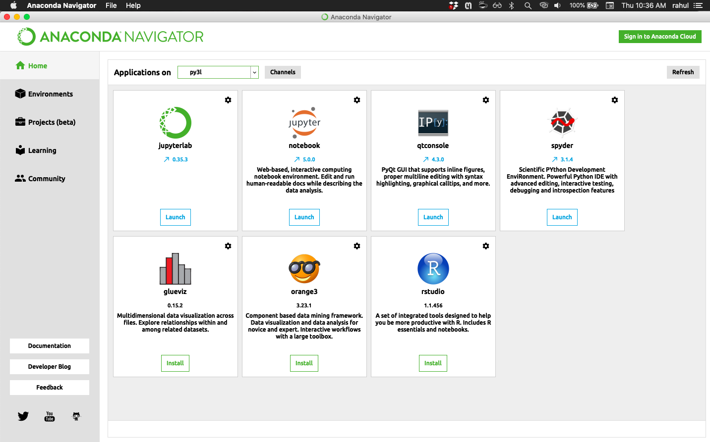
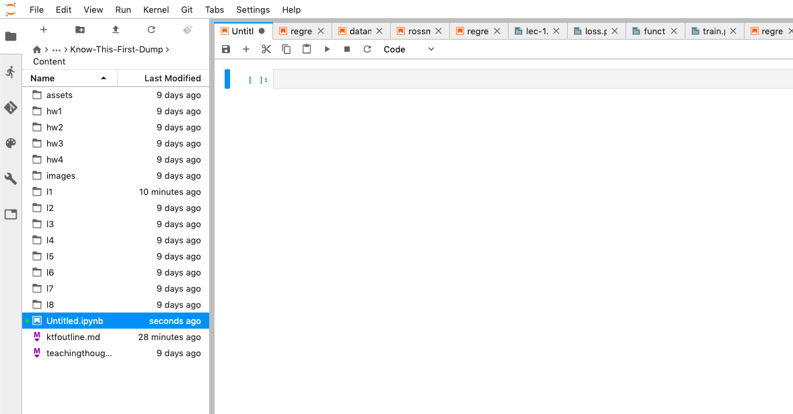
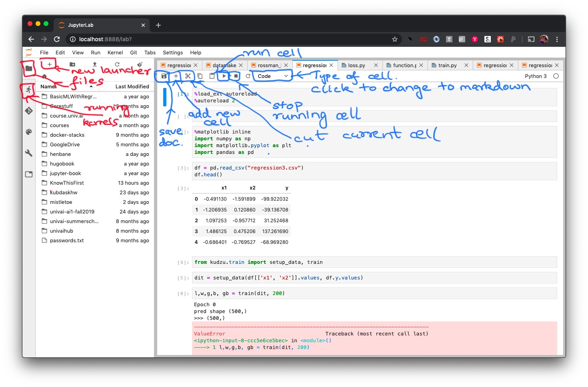

---
layout: page
title: Installing and Using Anaconda Python
math: true
--- 

Please try these things out before you come to the first class!

## First Install Anaconda

You need to first install Anaconda Python. The packages are [here](https://www.anaconda.com/products/individual#Downloads). You need to install the Python 3.7 version

These short videos from our youtube channel (recorded by Akshaj) walk you through the process of downloading and installing Anaconda.

First download:

<iframe width="916" height="491" src="https://www.youtube.com/embed/oJk4wbWCBIw" frameborder="0" allow="accelerometer; autoplay; encrypted-media; gyroscope; picture-in-picture" allowfullscreen></iframe>

Then install:

<iframe width="887" height="499" src="https://www.youtube.com/embed/HHnoXU-BcPE" frameborder="0" allow="accelerometer; autoplay; encrypted-media; gyroscope; picture-in-picture" allowfullscreen></iframe>

## Starting Anaconda

(1) Bring up the "Anaconda Navigator" from your Start Menu, Panel or text-entry point.

(2) Then click on "Jupyterlab". This will open up a web browser for you with a screen that looks like the next picture.

This screen is called the **Launcher**. Click on "Python 3". This launches a "kernel" or python process, and connects a new document window, called a **Jupyter Notebook** to this process. 

## The Jupyter Notebook

You can now type in text boxes in the Jupyter Notebook, called **cells** in this new window. The left side is a file manager and is likely showing your home folder. This notebook is called `Untitled.ipynb`.

Type `1+1` in the text box and hit "Shift-Enter" or mouse-press the "Play icon" on the toolbar at the top.

The answer 2 is printed out. 

A new cell appears at the bottom. 

## Jupyter cells have modes (and other GUI controls)

By default the cells are in `Code` mode. These can be changed to `Markdown` mode in the toolbar to enter text. The next picture shows some buttons and what they do.

