autoscale: true

#[fit] Python Environments

---

## Hyper-parameter optimization

Eg, **Gradient boosting**: The basic idea is to fit the residuals of tree based regression models again and again. Peter Prettenhofer, who wrote sklearns GBRT implementation writes in his pydata14 talk:

>*I usually follow this recipe to tune the hyperparameters*:

- Pick `n_estimators` as large as (computationally) possible (e.g. 3000)
- Tune `max_depth/min_samples_leaf`, `learning_rate`, and `max_features` via grid search
- A lower `learning_rate` requires a higher number of `n_estimators`. Thus increase `n_estimators` even more and tune `learning_rate` again holding the other params fixed. 

---


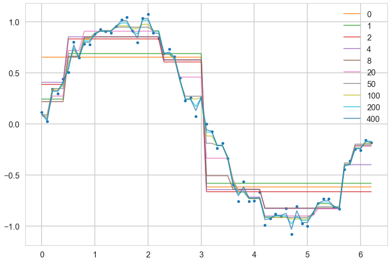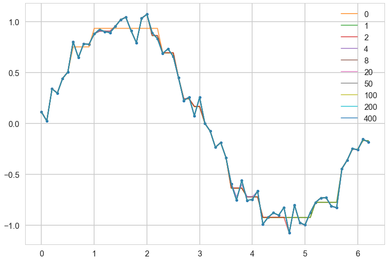

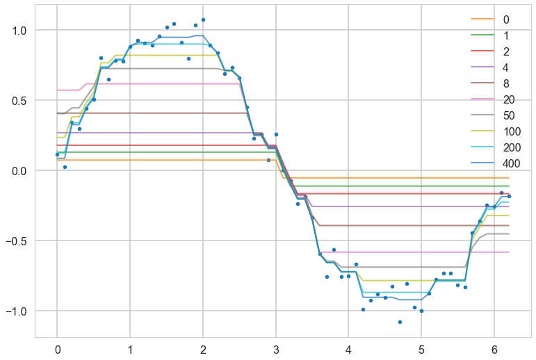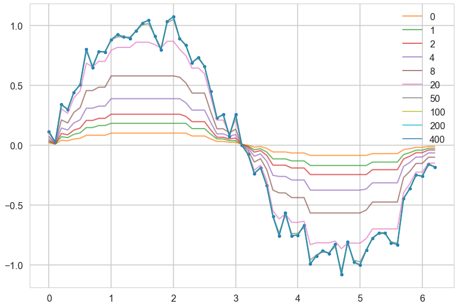

---

## Why is this bad? Or, why pipelines?

```python
from sklearn.model_selection import GridSearchCV

vectorizer = TfidfVectorizer()
vectorizer.fit(text_train)

X_train = vectorizer.transform(text_train)
X_test = vectorizer.transform(text_test)

clf = LogisticRegression()
grid = GridSearchCV(clf, param_grid={'C': [.1, 1, 10, 100]}, cv=5)
grid.fit(X_train, y_train)
```

**The purpose of the pipeline is to assemble several steps that can be cross-validated together while setting different parameters.**

---

## Grid search on pipelines

```python
from sklearn.feature_extraction.text import CountVectorizer, TfidfTransformer
from sklearn.linear_model import SGDClassifier
from sklearn.pipeline import Pipeline
from sklearn.model_selection import GridSearchCV
from sklearn.datasets import fetch_20newsgroups

categories = [
    'alt.atheism',
    'talk.religion.misc',
]
data = fetch_20newsgroups(subset='train', categories=categories)
pipeline = Pipeline([('vect', CountVectorizer()),
                     ('tfidf', TfidfTransformer()),
                     ('clf', SGDClassifier())])
grid = {'vect__ngram_range': [(1, 1)],
        'tfidf__norm': ['l1', 'l2'],
        'clf__alpha': [1e-3, 1e-4, 1e-5]}

if __name__=='__main__':
    grid_search = GridSearchCV(pipeline, grid, cv=5, n_jobs=-1)
    grid_search.fit(data.data, data.target)
    print("Best score: %0.3f" % grid_search.best_score_)
    print("Best parameters set:", grid_search.best_estimator_.get_params())
```


---

##ok, so you want to do this

### PERFORMANTLY, AND REPRODUCIBLY

- same random seed
- same programming environment on multiple machines (ideally same version of OS/python-conda stack/BLAS libraries, etc)
- then run the same code with a different parameter combination on each machine
- deal with the possible loss of some machines in this computation (they die, you got an amazon spot instance..)
- combine all the data output from these runs to make hyperparameter choices

---

## Programming environment: The multiple libraries problem

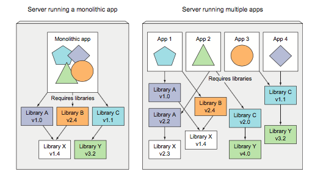

---

## The solution

#[fit] Virtual Environments

---

## But first:

#[fit] 1. Setting up your 
#[fit] Python Infrastructure

---

## Installing Anaconda/Miniconda/Miniforge

- If you are completely new, you can use anaconda, and you get a nice graphical user interface
- if you have some command line experience, you might want to use [Miniconda](https://docs.conda.io/en/latest/miniconda.html)
- Install miniconda on non m1 platforms if you like, and you get access to Anaconda Inc's `default` channel
- But you can (must if commercial and you dont want to pay) also leverage the community driven `conda-forge` channel using [miniforge](https://github.com/conda-forge/miniforge)
- Use miniforge on a m1 mac

---

## How this workshop will run

- We are not going to bother with the initial anaconda/miniconda/miniforge installation: this will take too much time. If you dont have such a system, install it and let us know on the community forum. We can help you.
- Instead, ee have set up a `conda-forge` based Jupyterlab installation for you at: [https://mybinder.org/v2/gh/univai-ghf/python-environments/HEAD](https://mybinder.org/v2/gh/univai-ghf/python-environments/HEAD). This uses the mybinder.org service. Click on the link to have a python environment set up for you in the cloud. You will get a web browser that looks like this:

---


---

This screen is called the **Launcher**. Click on "Python" to get a new document window, called a **Jupyter Notebook** to this process. 

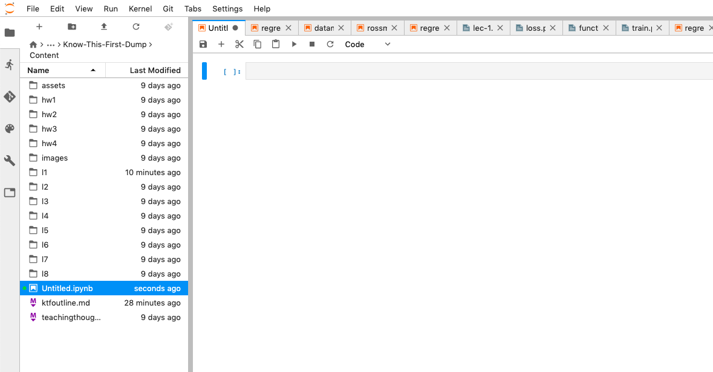

---

You can now type in text boxes in the Jupyter Notebook, called **cells** in this new window. The left side is a file manager and is likely showing your home folder. This notebook is called `Untitled.ipynb`.

Type `1+1` in the text box and hit "Shift-Enter" or mouse-press the "Play icon" on the toolbar at the top.

---

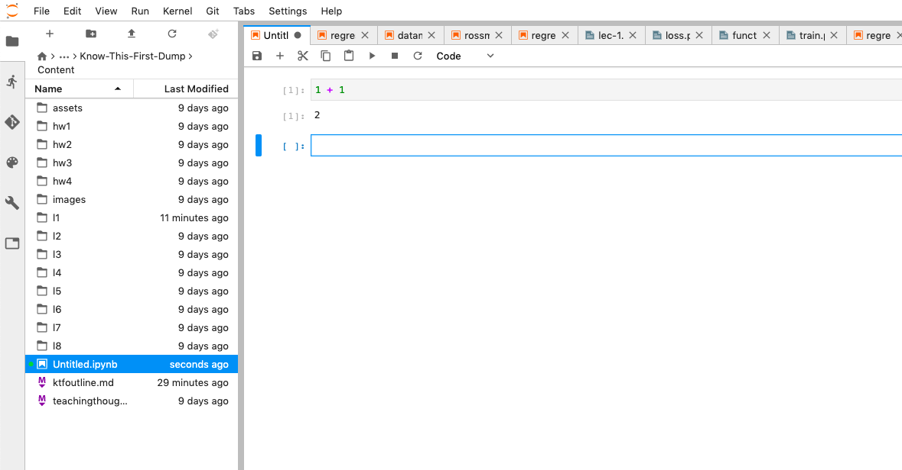

---

## Jupyter cells have modes (and other GUI controls)

By default the cells are in `Code` mode. These can be changed to `Markdown` mode in the toolbar to enter text. The next picture shows some buttons and what they do.

---
   
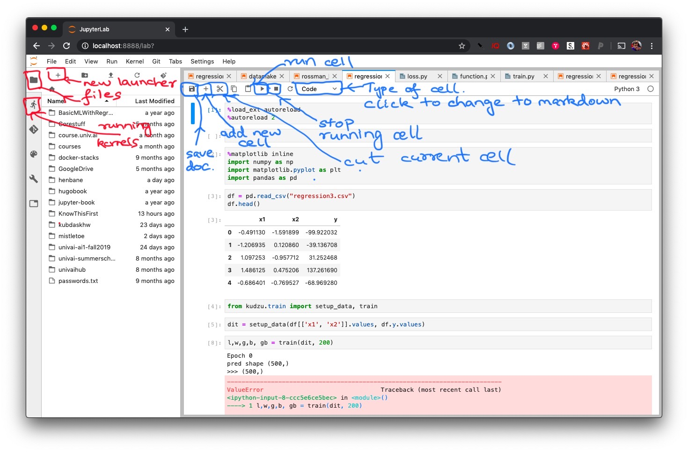

---

#[fit] 2. Setting up
#[fit] Virtual Environments

---

## What is a virtual environment?

- It's own set of packages that do not conflict with other sets of packages
- thus we can have competing packages with different dependency versions isolated from each other
- space is not wasted: packages can be installed into multiple environments if the dependencies are met

---

## Creating a virtual environment

- `conda create --name environment-name [python=3.6]`
- `conda activate environment-name`
- `conda deactivate environment-name`
- `conda install <packagename>`

Eg:

```
conda create -n newe
conda activate newe
conda install numpy pandas ipykernel
conda deactivate newe
```

---

## Making sure environments are available on jupyterlab

- in the base installation, make sure you `conda install nb_conda_kernels`.
- this will depend on how you installed the base. But run the above command is needed
- in our binder system, this is already installed.
- now in every new environment make sure you install `ipykernel`.

---

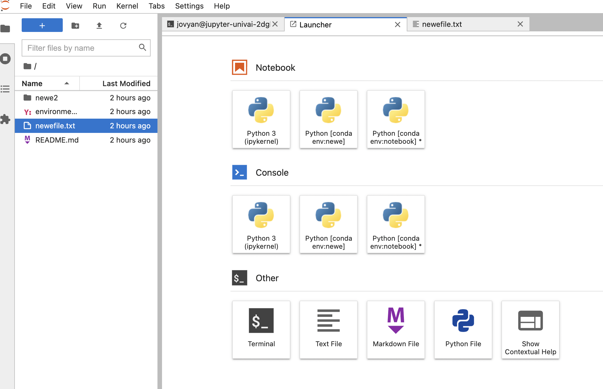

---

## Capturing a virtual environment

`conda env export` will capture the exact dependencies. You can now redirect into a file, and use elsewhere on the same OS to recreate this environment.

The file is usually called `environment.yml`, so we do:

`conda env export > environment.yml`

If this file is in a particular folder, just type `conda env create` to create an environment with these packages.

---

## Using environment.yml files

- you can write your own `environment.yml` file to be much less tied to specific package versions, unless needed.

For example, for an environment `newe2`, we create a folder `newe2`, and in that folder, we create a `environment.yml` with the contents:

```yaml
name: newe2
channels:
- conda-forge
dependencies:
- ipykernel
- matplotlib
- pandas
- numpy
- scipy
- seaborn
- scikit-learn
- tensorflow
- keras
```

---

## A conda env per project

- create a conda environment for each new project
- put an `environment.yml` in each project folder (like `newe2`) with a `name` line reflecting the folder name
- `conda|mamba env create` in project folder (like `newe2`)
- if not per project, at least have one for each new class, or class of projects
- environment for class of projects may grow organically, but capture its requirements from time-to-time.
- for example, on my dual-gpu machine, I have 3 separate environments for pytorch, tensorflow, and jax, as they even had slightly different CUDA requirements.

see [here](https://conda.io/projects/conda/en/latest/user-guide/tasks/manage-environments.html)


---

## Mamba

- mamba is a version of conda that works with conda but is faster.
- use `mamba` to create and/or install
- use `conda` to activate/deactivate
- See [https://mamba.readthedocs.io/en/latest/user_guide/mamba.html](https://mamba.readthedocs.io/en/latest/user_guide/mamba.html)
- on our binder environment I can issue `mamba env create`. Its faster. But then I must use `conda activate newe2` to startup the new environment
- by default conda will use both default and conda-forge channels, mamba will use conda-forge. I found keras currently only installable with mamba.

---


```yaml
# file name: environment.yml

# Give your project an informative name
name: project-name

# Specify the conda channels that you wish to grab packages from, in order of priority.
channels:
- defaults
- conda-forge

# Specify the packages that you would like to install inside your environment. 
#Version numbers are allowed, and conda will automatically use its dependency 
#solver to ensure that all packages work with one another.
dependencies:
- python=3.7
- conda
- scipy
- numpy
- pandas
- scikit-learn

# There are some packages which are not conda-installable. You can put the pip dependencies here instead.
- pip:
    - tqdm  # for example only, tqdm is actually available by conda.
```

( from http://ericmjl.com/blog/2018/12/25/conda-hacks-for-data-science-efficiency/)

---

## More information

- https://carpentries-incubator.github.io/introduction-to-conda-for-data-scientists/
- https://goodresearch.dev/setup.html , which is part of the excellent book
- https://goodresearch.dev/index.html

---

# [fit] 3. Structure

---

## The Importance of Structure

- one might as well use the one env per project ot set-of-projects structure to organize work
- it is really important to organize your data science work well
- a good tool for this is `cookiecutter`, which sets up a template folder structure for you. Install by `pip install cookiecutter` in your base.
- you install a cookiecutter by doing `cookiecutter source`.

---

## Two nice cookiecutters

- https://github.com/patrickmineault/true-neutral-cookiecutter
- Install via: `cookiecutter gh:patrickmineault/true-neutral-cookiecutter`
- https://drivendata.github.io/cookiecutter-data-science/
- Install via: `cookiecutter gh:drivendata/cookiecutter-data-science`

---

## True Neutral Cookiecutter

```
├── data
├── doc
├── results
├── scripts
├── src
│   └── __init__.py
├── tests
├── .gitignore
├── environment.yml
├── README.md
└── setup.py
```

---

## An example

- We do: `cookiecutter gh:drivendata/cookiecutter-data-science`
- name the project perceptron
- create the conda environment:
- `conda create --name perceptron; conda activate perceptron; mamba install ipykernel numpy tensorflow keras` or do `mamba env create` with an appropriate environment file
- then do `pip install -e .` which creates the src directory loadable into python

---

## Best practices for use

- now we can do development with both the notebook and files. In anotebook cell put the following to have the notebook automatically reload the file when it changes.

```
%load_ext autoreload
%autoreload 2
```

- refactor anything repeated multiple times to python files with functions in them. Notebooks should be very readable
- output all intermediate files into `data` or `results` while writing your pipelines: files from train test splits, parameter values and results, etc
- future you will than current you.

---

#[fit] 4. Extra

---

## Going even further: Docker

- More than python libs
- C-library, BLAS, linux kernel, etc
- we could use virtual machines (VMs) like vmware/virtualbox/lvm
- but these are heavy duty, OS level "hypervisor"s
- more general, but resource hungry

---

## Containers vs Virtual Machines

- containers provide process isolation, process throttling
- but work at library and kernel level, and can access hardware more easily
- hardware access important for gpu access
- containers can run on VMS, this is how docker runs on mac, and on many cloud providers. They can also run on a host linux OS on bare metal
  
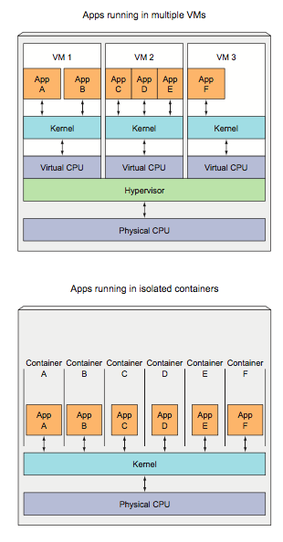

---

## Docker Architecture

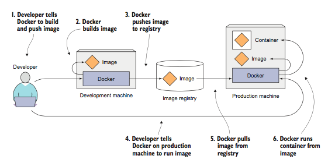

---

## Docker images

- docker is linux only, but other OS's now have support
- allow for environment setting across languages and runtimes
- can be chained together to create outcomes
- base image is a linux (full) image, others are just layers on top
- side benefit: integration testing and testing for CI

---

## An Example

[base notebook](https://github.com/jupyter/docker-stacks/blob/master/base-notebook/Dockerfile) `->` [minimal notebook](https://github.com/jupyter/docker-stacks/blob/master/minimal-notebook/Dockerfile) `->`  [scipy notebook](https://github.com/jupyter/docker-stacks/blob/master/scipy-notebook/Dockerfile) `->`  [tensorflow notebook](https://github.com/jupyter/docker-stacks/blob/master/tensorflow-notebook/Dockerfile)

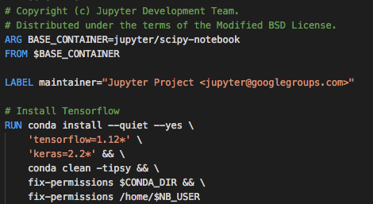

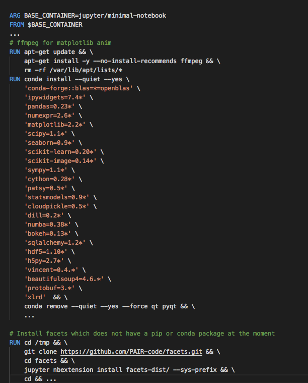

---

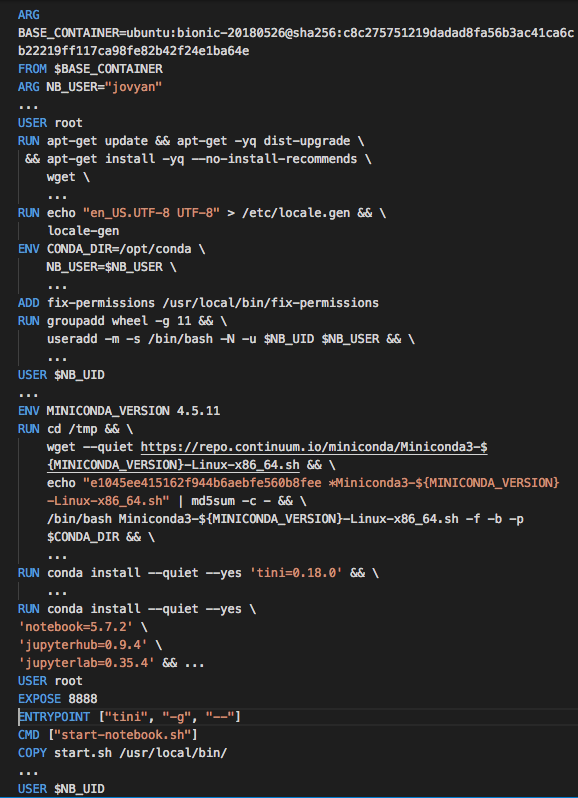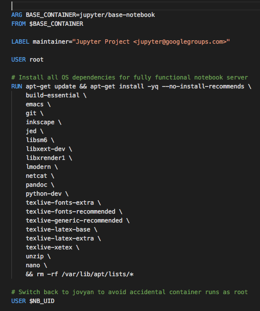

---


## repo2docker and binder

- building docker images is not dead simple
- the Jupyter folks created [repo2docker](https://repo2docker.readthedocs.io/en/latest/) for this.
- provide a github repo, and repo2docker makes a docker image and uploads it to the docker image repository for you
- [binder](http://mybinder.org) builds on this to provide a service where you provide a github repo, and it gives you a working jupyterhub where you can "publish" your project/demo/etc
- built repo's can be used with multiple software such as jupyterhub/dask/kubernetes, etc


